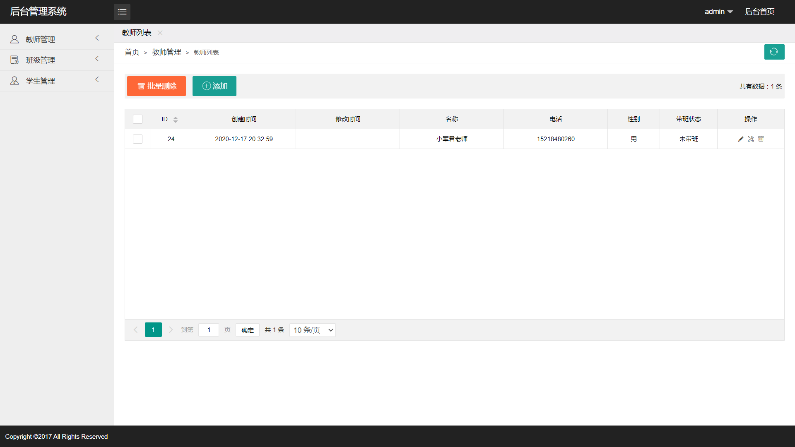
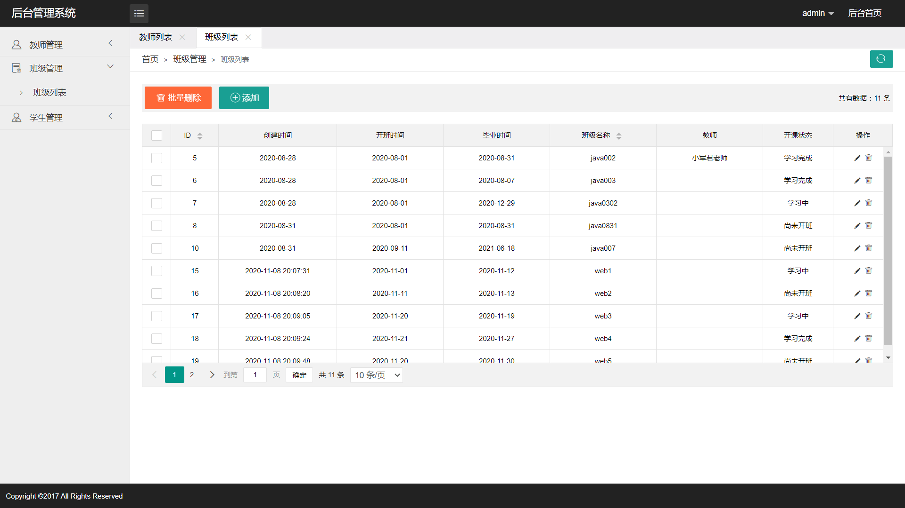

# 班级管理系统（前端）

#### 介绍
本项目为学习与练习项目，实现一个简单的班级管理系统练习 C3P0 数据库连接池的使用步骤。主要功能包括班级管理、教师管理以及学生管理。

#### 链接
班级管理系统：[http://m.yongkj.cn/html/class/](http://m.yongkj.cn/html/class/)

#### 截图

#### 技术栈
HTML+CSS+JS+JQuery+Layui

1.  使用 Layui 中的方法渲染方式实现表格数据展示
2.  实现数据的批量删除功能

#### 功能特性

1.  班级、教师以及学生信息的增加、删除、修改
2.  点击页面的刷新按钮即可刷新当前展示的表格数据

#### 使用说明

1.  HTML 文件中有 AJAX 代码，用于获取后台数据以及渲染数据，除了将数据接口更改后，还要修改表格的表头信息才能正常显示相应的数据
